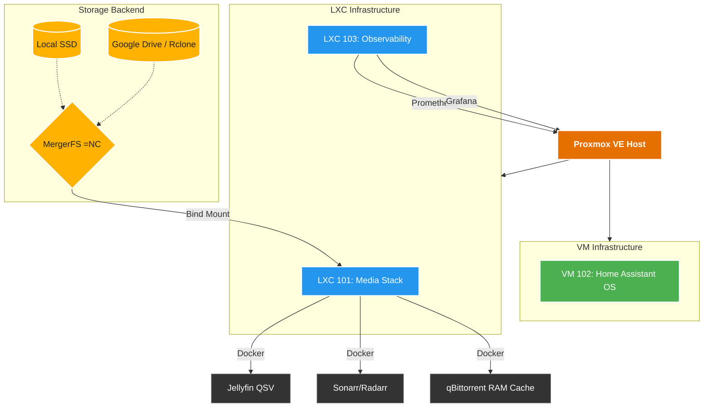

# 🚀 Enterprise-Grade Homelab Infrastructure

<p align="center">
  
  
  
  
</p>

Welcome to my personal Infrastructure as Code (IaC) repository. This repository documents and manages my hyperconverged Homelab environment running on **Proxmox VE**, utilizing strict DevOps principles, GitOps workflows, and TRaSH-Guides standards.

---

## 🏗️ Hardware Specifications

The infrastructure is hosted on a single-node hypervisor optimized for low power consumption and high efficiency (Intel QSV hardware transcoding).

| Component | Specification | Notes |
| :--- | :--- | :--- |
| **CPU** | Intel Core i3-8100 (4 Cores @ 3.60GHz) | Intel UHD 630 (QSV Passthrough enabled) |
| **Memory** | 16 GB DDR4 | 2GB Swap configured for Docker |
| **Storage** | 250 GB SATA SSD | LVM-Thin Provisioning (fstrim optimized) |
| **Network** | 1 Gbps Ethernet | Tailscale Zero-Trust VPN |

---

## 🕸️ Architecture Topology

The infrastructure is strictly segregated into dedicated LXC containers and Virtual Machines for security and resource management.



---

## 📂 Repository Structure

```text
homelab-infrastructure/
├── 📁 ai-skills/            # Embedded AI Assistant Behaviors & Policies
├── 📁 ansible/              # IaC Playbooks for server maintenance and deployment
├── 📁 docker-stacks/        # Docker Compose files (Media, Monitoring, etc.)
│   └── 📁 media-stack/      # TRaSH-Guides compliant media environment
├── 📁 docs/                 # Detailed architectural documentation
└── 📄 CHANGELOG.md          # Immutable history of server modifications
```

---

## 🔒 Security & DevOps Philosophy

1. **Principle of Least Privilege**: The `root` account is disabled for direct SSH. Administration is performed via a dedicated `sudoer` account (`devkram`) using ED25519 SSH Keys.
2. **Immutability**: Containers rely on Read-Only mounts and strict PUID/PGID enforcement.
3. **Storage Efficiency**: The Media Stack utilizes an advanced `MergerFS` + `Rclone` hybrid architecture. Downloads hit the local SSD, are atomically hardlinked by Sonarr/Radarr, and automatically offloaded to the encrypted cloud overnight to preserve local storage.
4. **AI-Assisted Operations**: This repository contains global `.cursorrules` and embedded AI skills (`ai-skills/homelab-devops-engineer`) to ensure any AI agent interacting with this server adheres strictly to these infrastructure rules.

