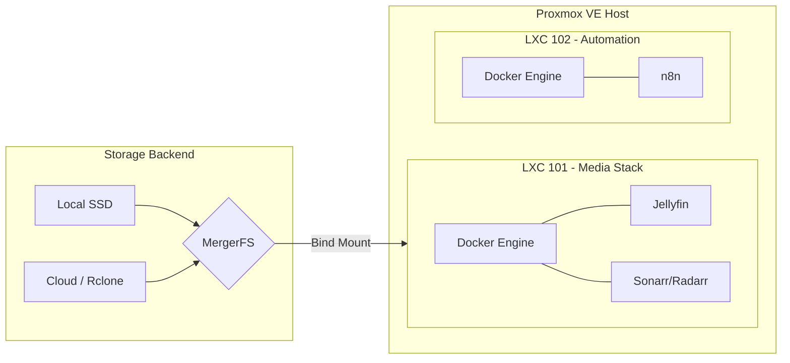
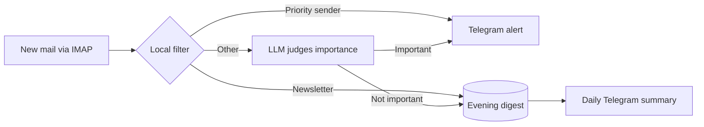

  
  
  

  <h1>Homelab Infrastructure</h1>
  
Configuration, scripts and documentation for a personal Proxmox VE homelab.

---

## Overview

This repository documents and version-controls a personal Proxmox VE homelab: the layout of the node, the Docker stacks running in its containers, and the maintenance scripts. Changes are made by hand on the server and recorded here, so the repository is the reference for what is deployed. It is deliberately not an automated Infrastructure-as-Code pipeline: [`CHANGELOG.md`](CHANGELOG.md) records what changed and when, and [`TODO.md`](TODO.md) lists known gaps and open work.

## Hardware Specifications

| Component | Specification | Description |
|---|---|---|
| **Hypervisor** | Proxmox VE 9.x on a Dell OptiPlex 3060 | Bare-metal virtualization on Debian 13 |
| **Compute** | Intel Core i3-8100 (UHD Graphics 630) | 4 Cores @ 3.60GHz, QSV Passthrough enabled |
| **Memory** | 16 GB DDR4 | 2 x 8 GB @ 2400 MT/s |
| **Storage** | 250 GB SATA SSD (WD Blue) | LVM-Thin provisioned |
| **Network** | 1 Gbps Ethernet | Tailscale overlay network |

### Equipment inventory

| Equipment | Role |
|---|---|
| Dell OptiPlex 3060 | The Proxmox VE node described above |
| 2 × Intel NUC (NUC6CAYS) | Run Proxmox VE, no workloads yet |
| Linux workstation and Linux laptop | Administration, reachable over Tailscale |
| iPhone | Mobile access over Tailscale |
| Home router | Gateway of the `192.168.1.0/24` LAN |
| Google Drive (5 TB), encrypted with rclone | Cold storage tier of the media pool |

The Proxmox node documented in this repository is standalone: it is not part of a cluster.

## Architecture Topology

The environment is strictly segregated into purpose-built containers (LXC) and virtual machines to ensure security boundaries and resource isolation.

### Guests

| ID | Hostname | IP | Resources | Role |
|---|---|---|---|---|
| 101 | `media-stack` | 192.168.1.150 | 3 cores, 6 GB RAM, 102 GB disk | Jellyfin, *arr suite, qBittorrent |
| 102 | `automation` | 192.168.1.151 | 2 cores, 3 GB RAM, 10 GB disk, unprivileged | n8n workflow automation (notifications, scraping, AI, home automation) |

LXC 102 is deliberately separate from the media stack: a runaway workflow cannot starve Jellyfin, and it runs unprivileged since it needs no device passthrough.

## Automation: mail triage

An n8n workflow (LXC 102) watches a mailbox over IMAP and notifies on Telegram only when a mail is worth attention. A local filter runs first, so the LLM (Groq, free plan) only sees what the filter cannot decide.

The mailbox is never modified. If the LLM is unavailable the mail is notified anyway, a failed execution sends an alert, and the daily summary doubles as a heartbeat. Workflow, credential template and deployment script live in [`docker-stacks/automation/`](docker-stacks/automation/); secrets stay in a git-ignored `.env` per workflow.

## Directory Structure

- `ai-skills/` - Custom behavioral instructions for AI agents operating in this workspace.
- `docker-stacks/` - Compose definitions for containerized services (`media-stack/` in LXC 101, `automation/` with its n8n workflows in LXC 102).
- `scripts/` - Host-level maintenance scripts (SSD trim, encrypted cloud offload).
- `CHANGELOG.md` / `TODO.md` - What changed, and what is still open.

## Core Design Principles

1. **The repository is the record:** every change to the server is written down here, including known gaps, so the documentation never claims more than what runs.
2. **Least Privilege:** Containers utilize read-only mounts where possible, the automation container runs unprivileged, and secrets never enter the repository (`.env` files are git-ignored). The `root` account is disabled for remote access, relying exclusively on an unprivileged `sudoer` account with SSH keys.
3. **Storage Efficiency:** Media management utilizes a hybrid local/cloud approach via MergerFS and Rclone. Local storage handles write-intensive operations, while cold data is asynchronously offloaded to cloud storage.
