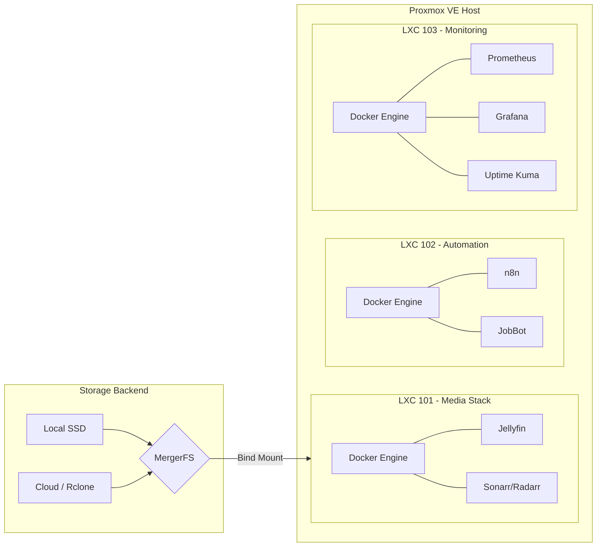
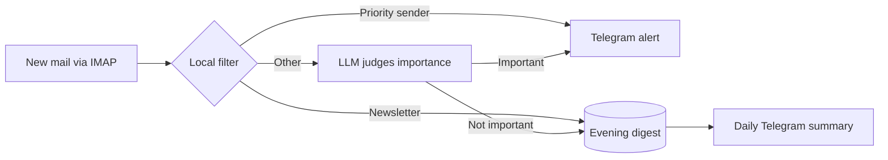
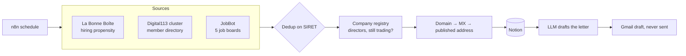

<div align="center">
  
  
  

  <h1>Homelab Infrastructure</h1>
  <p>Configuration, scripts and documentation for a personal Proxmox VE homelab.</p>
</div>

---

## Overview

This repository documents and version-controls a personal Proxmox VE homelab: the layout of the node, the Docker stacks running in its three containers, the two long-lived automations they host, and the maintenance scripts. Changes are made by hand on the server and recorded here, so the repository is the reference for what is deployed. It is deliberately not an automated Infrastructure-as-Code pipeline: [`CHANGELOG.md`](CHANGELOG.md) records what changed and when, and [`TODO.md`](TODO.md) lists known gaps and open work — including the ones that are uncomfortable to write down.

## Hardware Specifications

| Component | Specification | Description |
|---|---|---|
| **Hypervisor** | Proxmox VE 9.x on a Dell OptiPlex 3060 | Bare-metal virtualization on Debian 13 |
| **Compute** | Intel Core i3-8100 (UHD Graphics 630) | 4 Cores @ 3.60GHz, QSV Passthrough enabled |
| **Memory** | 16 GB DDR4 | 2 x 8 GB @ 2400 MT/s |
| **Storage** | 250 GB SATA SSD (WD Blue) | LVM-Thin provisioned |
| **Network** | 1 Gbps Ethernet | Tailscale overlay network |

### Equipment inventory

| Equipment | Role |
|---|---|
| Dell OptiPlex 3060 | The Proxmox VE node described above |
| Intel NUC (NUC6CAYS) | Smart TV (media player) |
| Intel NUC (NUC6CAYS), second unit | Spare, currently unused |
| Linux workstation and Linux laptop | Administration, reachable over Tailscale |
| iPhone | Mobile access over Tailscale |
| Home router | Gateway of the `192.168.1.0/24` LAN |
| Google Drive (5 TB), encrypted with rclone | Cold storage tier of the media pool |

The Proxmox node documented in this repository is standalone: it is not part of a cluster.

## Architecture Topology

The environment is strictly segregated into purpose-built containers (LXC) and virtual machines to ensure security boundaries and resource isolation.



### Guests

| ID | Hostname | IP | Resources | Role |
|---|---|---|---|---|
| 101 | `media-stack` | 192.168.1.150 | 3 cores, 6 GB RAM, 102 GB disk | Jellyfin, *arr suite, qBittorrent |
| 102 | `automation` | 192.168.1.151 | 2 cores, 3 GB RAM, 10 GB disk, unprivileged | n8n workflow automation, JobBot job-search engine |
| 103 | `monitoring` | 192.168.1.39 | 2 cores, 2 GB RAM, 8 GB disk, unprivileged | Prometheus, Grafana, Uptime Kuma, cAdvisor, Homepage |

LXC 102 is deliberately separate from the media stack: a runaway workflow cannot starve Jellyfin, and it runs unprivileged since it needs no device passthrough.

## Monitoring

LXC 103 runs the observability stack, kept in [`docker-stacks/monitoring/`](docker-stacks/monitoring/).

| Service | Port | Role |
|---|---|---|
| Homepage | 3002 | Landing dashboard for every service on the node |
| Grafana | 3000 | Dashboards over the Prometheus data |
| Prometheus | 9090 | Metrics storage |
| Uptime Kuma | 3001 | Availability checks (ping / HTTP) |
| cAdvisor | 8080 | Per-container resource metrics |

This stack was decommissioned once as unused, then reinstated: the node now runs three
containers and two long-lived automations, and a silent failure in one of them is no longer
something a glance at the shell reveals.

## Development inside an unprivileged container

JobBot (below) runs in LXC 102 and its source lives there, in `/opt/dev/jobbot`. The same
directory is reachable from the host at `~/dev/jobbot`, so files are edited with normal
tooling while every command runs inside the container.

Bind-mounting a host directory into an *unprivileged* container normally makes it unwritable
on one side or the other: the container's `root` maps to host UID 100000, and the host user is
1002. The fix is a narrow identity mapping in the container config, which maps UID 1002 to
itself and leaves everything else where it was:

```
mp0: /home/devkram/dev,mp=/opt/dev
lxc.idmap: u 0 100000 1002
lxc.idmap: g 0 100000 1002
lxc.idmap: u 1002 1002 1      # the shared UID, identical on both sides
lxc.idmap: g 1002 1002 1
lxc.idmap: u 1003 101003 64533
lxc.idmap: g 1003 101003 64533
```

`root:1002:1` is delegated in `/etc/subuid` and `/etc/subgid`. The container's `root` keeps its
original mapping, so existing data — including the n8n volume — is untouched.

This matters beyond convenience: the host runs Debian 13 with **Python 3.13**, and JobBot
depends on `python-jobspy`, which pins `numpy==1.26.3` and does not build there. The container
runs Python 3.11. Running JobBot on the hypervisor is not a style preference, it does not work.

## Automation: mail triage

An n8n workflow (LXC 102) watches a mailbox over IMAP and notifies on Telegram only when a mail is worth attention. A local filter runs first, so the LLM (Groq, free plan) only sees what the filter cannot decide.



The mailbox is never modified. If the LLM is unavailable the mail is notified anyway, a failed execution sends an alert, and the daily summary doubles as a heartbeat. Workflow, credential template and deployment script live in [`docker-stacks/automation/`](docker-stacks/automation/); secrets stay in a git-ignored `.env` per workflow.

## Automation: apprenticeship search

The node's second automation supports a concrete goal: finding a company for a two-year
systems-and-networks apprenticeship around Toulouse. n8n owns the pipeline; a Python engine
([JobBot](https://github.com/kromz-dev/jobbot), LXC 102) is one source among several, called
over HTTP.



Three design rules carry most of the weight:

- **Contact details are found, never guessed.** Only addresses a company publishes itself are
  kept — its site, its legally mandatory `mentions légales`, its team page — and the mail
  domain is checked for MX records first. No `firstname.lastname@` construction: a bounce
  damages the sender reputation of the very mailbox used to apply. Where nothing is published,
  the row says so instead of inventing a plausible address.
- **Nothing is sent automatically.** The LLM writes a draft into Gmail; a human reads it and
  presses send. The bottleneck in a job search is targeting, not typing.
- **Deduplication is tested, not hoped for.** The workflow is run twice in a row and the
  destination row count must not move. The SIRET is the key, because company names differ
  between sources.

Search providers are chained by free quota with automatic failover (Serper → Tavily →
Firecrawl → Exa → Brave), and a hard per-run cap protects the one paid account. LinkedIn,
Discord and Slack are deliberately excluded: reading them programmatically breaks their terms
and risks the accounts the search itself depends on.

Plans live in [`docs/plans/`](docs/plans/).

## Directory Structure

- `ai-skills/` - Custom behavioral instructions for AI agents operating in this workspace.
- `docker-stacks/` - Compose definitions for containerized services (`media-stack/` in LXC 101, `automation/` with its n8n workflows in LXC 102, `monitoring/` in LXC 103).
- `docs/plans/` - Implementation plans for the automations, written before the code.
- `scripts/` - Host-level maintenance scripts (SSD trim, encrypted cloud offload).
- `CHANGELOG.md` / `TODO.md` - What changed, and what is still open.

## Core Design Principles

1. **The repository is the record:** every change to the server is written down here, including known gaps, so the documentation never claims more than what runs.
2. **Least Privilege:** Containers utilize read-only mounts where possible, the automation container runs unprivileged, and secrets never enter the repository (`.env` files are git-ignored). The `root` account is disabled for remote access, relying exclusively on an unprivileged `sudoer` account with SSH keys.
3. **Storage Efficiency:** Media management utilizes a hybrid local/cloud approach via MergerFS and Rclone. Local storage handles write-intensive operations, while cold data is asynchronously offloaded to cloud storage.
