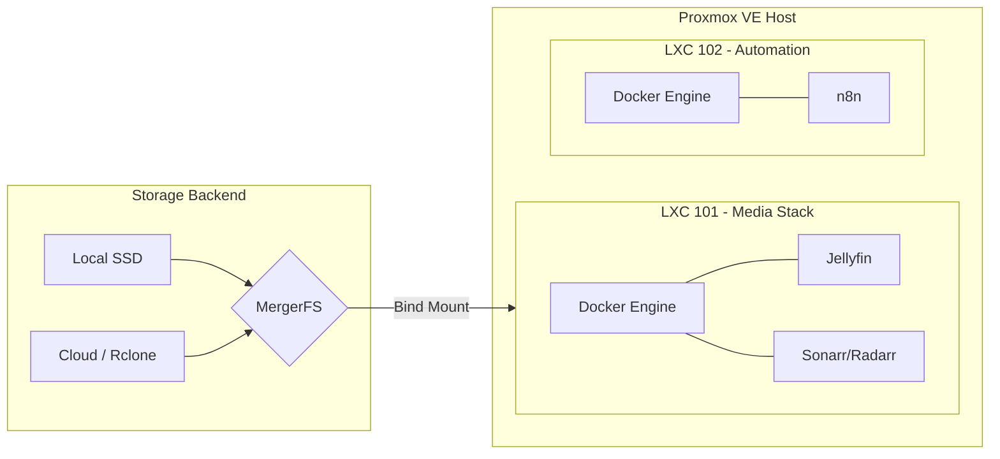

  
  
  

  <h1>Homelab Infrastructure</h1>
  
Infrastructure as Code (IaC) repository for a hyperconverged homelab environment.

---

## Overview

This repository manages the configuration, deployment, and automation of a single-node Proxmox VE environment. The infrastructure follows GitOps principles, ensuring all changes to the system state are version-controlled, reproducible, and deployed via code.

## Hardware Specifications

| Component | Specification | Description |
|---|---|---|
| **Hypervisor** | Proxmox VE 9.x | Bare-metal virtualization on Debian 13 |
| **Compute** | Intel Core i3-8100 | 4 Cores @ 3.60GHz, QSV Passthrough enabled |
| **Memory** | 16 GB DDR4 | 2 x 8 GB @ 2400 MT/s |
| **Storage** | 250 GB SATA SSD | LVM-Thin provisioned |
| **Network** | 1 Gbps Ethernet | Tailscale overlay network |

## Architecture Topology

The environment is strictly segregated into purpose-built containers (LXC) and virtual machines to ensure security boundaries and resource isolation.

### Guests

| ID | Hostname | IP | Resources | Role |
|---|---|---|---|---|
| 101 | `media-stack` | 192.168.1.150 | 3 cores, 6 GB RAM, 102 GB disk | Jellyfin, *arr suite, qBittorrent |
| 102 | `automation` | 192.168.1.151 | 2 cores, 3 GB RAM, 10 GB disk, unprivileged | n8n workflow automation (notifications, scraping, AI, home automation) |

LXC 102 is deliberately separate from the media stack: a runaway workflow cannot starve Jellyfin, and it runs unprivileged since it needs no device passthrough.

## Directory Structure

- `ai-skills/` - Custom behavioral instructions for AI agents operating in this workspace.
- `docker-stacks/` - Compose definitions for containerized services (`media-stack/` in LXC 101, `automation/` in LXC 102).
- `scripts/` - Host-level maintenance scripts (SSD trim, encrypted cloud offload).

## Core Design Principles

1. **Infrastructure as Code (IaC):** Server modifications are performed via configuration files, not manual command-line execution.
2. **Immutability & Least Privilege:** Containers utilize read-only mounts where possible. The `root` account is disabled for remote access, relying exclusively on an unprivileged `sudoer` account with SSH keys.
3. **Storage Efficiency:** Media management utilizes a hybrid local/cloud approach via MergerFS and Rclone. Local storage handles write-intensive operations, while cold data is asynchronously offloaded to cloud storage.
