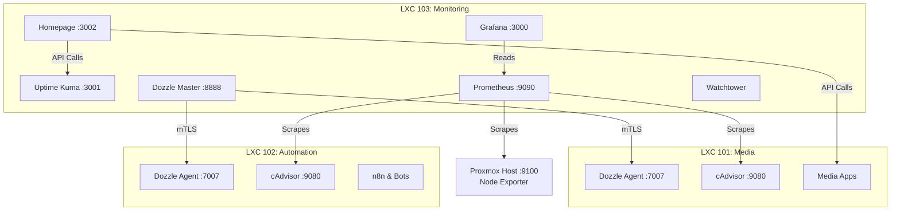

# Observability & Monitoring Stack 👁️

> Ultimate Homelab Command Center with Performance Metrics, Alerting, Log Aggregation, and an interactive Dashboard.

## 🚀 Quick Start

1. Clone the repository and navigate to this folder.
2. Ensure you have copied `homepage/services.example.yaml` to `homepage/services.yaml` and filled in your API keys.
3. Generate `.dozzle_secrets` in your other stacks for secure log forwarding.
4. Run the stack:
   ```bash
   docker compose up -d
   ```

## 🏗️ Architecture



## ✨ Features

- **Grafana & Prometheus**: Real-time performance metrics (Hardware & Containers).
  - *Dashboard 1860*: Proxmox Node metrics.
  - *Dashboard 14282*: Docker cAdvisor metrics.
- **Uptime Kuma**: Active blackbox monitoring (Ping/HTTP) with notification routing.
- **Dozzle Multi-Node**: Real-time centralized log viewing across all LXCs via mTLS.
- **Homepage**: 3D glass-morphism command center linking all services.
- **Watchtower**: Silent auto-updating for the monitoring stack at 4:00 AM daily.

## ⚙️ Configuration

### Secret Management
⚠️ **Zero Secrets in Git**: 
- All `.env` and `.dozzle_secrets` files are strictly ignored.
- Homepage configuration (`services.yaml`) is git-ignored. Use `services.example.yaml` as your template.

### Adding a new Dozzle Agent
To link a new node to the Dozzle Master, create a `.dozzle_secrets` file in the target node's stack containing `DOZZLE_CERT_PEM` and `DOZZLE_KEY_PEM` to enforce mTLS.

## 📚 Documentation

- [Prometheus Configuration](prometheus.yml)
- [Homepage Templates](homepage/services.example.yaml)
- [Grafana Provisioning](docker-compose.yml)

## 📄 License
MIT
