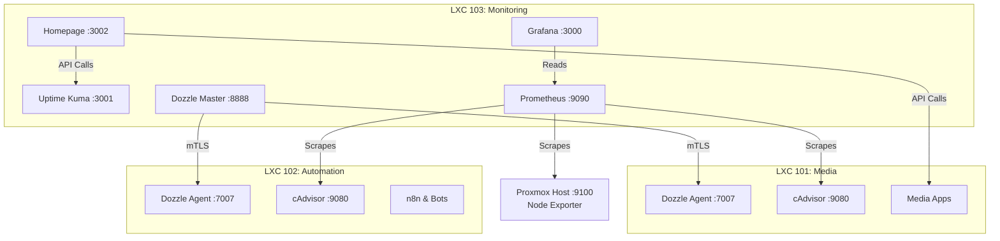

# Observability & Monitoring Stack 👁️

> Metrics, availability checks, log viewing and a landing page for the three LXCs. It observes; it does **not** alert yet (see [Current state](#current-state)).

## 🚀 Quick Start

1. Clone the repository and navigate to this folder.
2. Ensure you have copied `homepage/services.example.yaml` to `homepage/services.yaml` and filled in your API keys.
3. Dozzle agents run in the other stacks (`media-stack`, `automation`). How their mTLS certificates are provisioned is not described by the compose files in this repository yet; see the root `TODO.md`.
4. Run the stack:
   ```bash
   docker compose up -d
   ```

## 🏗️ Architecture



## ✨ What runs

Six containers in LXC 103 (checked 2026-10-02):

- **Prometheus**: stores metrics, 15 days of retention. Scrapes cAdvisor in the three LXCs and the Proxmox host's node exporter. All five targets are up.
- **Grafana**: connected to Prometheus, but **no dashboard is provisioned**. The admin password has been changed from the default.
- **Uptime Kuma**: 12 ping/HTTP probes.
- **Dozzle** (master): one log viewer for all three LXCs, through agents in LXC 101 and 102. The agents refuse connections that present no client certificate (mTLS), which was verified from outside the container: the TLS handshake ends with `certificate required`.
- **Homepage**: landing page linking every service (the config with API keys is git-ignored).
- **cAdvisor**: per-container metrics for LXC 103 itself. LXC 101 and 102 run their own, on port 9080.

## Current state

What this stack does **not** do, despite what earlier versions of this file claimed:

- **No alerting.** Uptime Kuma has 0 notification channels, Prometheus has 0 alert rules and no Alertmanager, Grafana has 0 alert rules. A probe can go red and nobody is told.
- **No Grafana dashboards.** The community dashboards 1860 (node metrics) and 14282 (cAdvisor) were listed here but never imported; Grafana holds none.
- **No auto-update.** `docker-compose.yml` declares a Watchtower service (daily at 04:00), but that container is not running and its image has never been pulled on this machine. It is declared, not deployed. Every image here tracks `latest` except Uptime Kuma (`:2`), so updates happen only when someone pulls by hand.
- **Disk space is tight.** The container has an 8 GB disk, and Prometheus has already hit `no space left on device` once (2026-09-30 to 2026-10-01), leaving a gap in the metrics.

Open work is in the root [`TODO.md`](../../TODO.md).

## ⚙️ Configuration

### Secret Management
⚠️ **Zero Secrets in Git**: 
- All `.env` and `.dozzle_secrets` files are git-ignored (the latter since 2026-10-01).
- Homepage configuration (`services.yaml`) is git-ignored. Use `services.example.yaml` as your template.

### Adding a new Dozzle Agent
To link a new node, run a Dozzle agent (`command: agent`, port 7007) in its stack and add its address to `DOZZLE_REMOTE_AGENT` on the master. Certificate provisioning for mTLS is not documented here yet.

## 📚 Documentation

- [Prometheus Configuration](prometheus.yml)
- [Homepage Templates](homepage/services.example.yaml)
- [Compose file](docker-compose.yml) (Grafana has no provisioning)

## 📄 License
MIT
